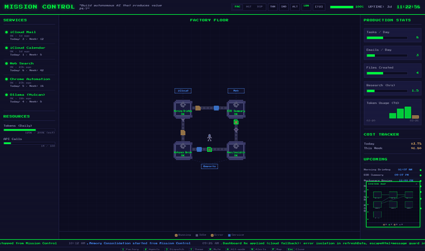

# Mission Control Dashboard

8-bit retro × Factorio-style monitoring UI for autonomous AI agent systems.



📄 **[Architecture One-Pager (PDF)](architecture-onepager.pdf)** — How the multi-agent system connects: Janus, Vulcan, dispatch pipeline, memory layer, and this dashboard.

## Overview

A single-file HTML dashboard that visualizes scheduled task activity, agent status, service health, dispatch pipelines, and production metrics — rendered entirely on canvas with pixel-art aesthetics, CRT effects, and a Factorio-inspired factory floor. Includes a Python server for interactive task and agent control, live dispatch monitoring, and a configurable external data directory.

## Quick Start

### Read-only mode (static file server)

```bash
python3 -m http.server 8080
```

### Interactive mode (recommended)

```bash
python3 server.py          # default port 8080
python3 server.py 9090     # custom port
```

Open `http://localhost:8080/mission-control.html`

The Python server adds PATCH APIs for task/agent control, live dispatch monitoring, configurable external data directories, and CORS support.

### As a macOS service

```bash
./install-service.sh       # one-time: copies launchd plist
mc start                   # start the service
mc status                  # check health
mc open                    # open dashboard in browser
mc logs                    # tail server logs
```

## Project Structure

```
mission-control-dashboard/
├── mission-control.html       # Single-file dashboard (HTML + CSS + Canvas)
├── server.py                  # Python server with PATCH API + live dispatch
├── server.js                  # Alternative Node.js server (PATCH API only)
├── mc                         # CLI service manager (start/stop/status/logs)
├── install-service.sh         # macOS launchd service installer
├── com.openclaw.mission-control.plist  # launchd plist (gitignored template)
├── learning-hub.html          # Learning hub POC
├── mission-control.skill      # Packaged Cowork skill (zip archive)
├── architecture-onepager.pdf   # System architecture one-pager
├── mission-control-demo.gif   # Animated demo for README
├── data/                      # JSON data layer (gitignored — populated at runtime)
│   ├── tasks.json             # Scheduled task status and metrics
│   ├── activity.json          # Rolling event feed (last 50)
│   ├── agents.json            # Agent profiles, org chart, metrics
│   ├── services.json          # Connected service health
│   ├── metrics.json           # Throughput stats, token usage, cost
│   ├── dispatch.json          # Dispatch queue state
│   └── alerts.json            # Alert definitions and thresholds
└── .claude/skills/mission-control/
    ├── SKILL.md               # Cowork skill definition
    └── scripts/
        └── dashboard_update.py  # CLI tool for updating dashboard data
```

## Views

The dashboard has three main views, switchable via the top nav or keyboard shortcuts:

- **Factory Floor** — Pixel-art machines represent scheduled tasks with animated gears, conveyor belts, flowing items, service nodes, and an idle worker that wanders the floor. Hover a machine for last-run tooltip; click for full details and Run/Stop control.
- **Agent Workspace** — Agent profiles, delegation stats, and org-chart visualization for your multi-agent system.
- **Dispatch Pipeline** — Live view of queued, in-progress, and completed task specs flowing through the file-based dispatch system.

## API

### Python server (`server.py`)

| Method | Endpoint | Description |
|--------|----------|-------------|
| `GET` | `/` | Serves `mission-control.html` |
| `GET` | `/health` | Health check with uptime |
| `GET` | `/data/*.json` | Serves data files (supports external `DATA_DIR`) |
| `GET` | `/api/dispatch` | Live dispatch directory listing |
| `PATCH` | `/data/tasks.json` | Update a task's fields |
| `PATCH` | `/data/agents.json` | Update an agent's fields |

PATCH accepts JSON with an `id` field plus any of: `status`, `lastResult`, `lastRun`, `nextRun`. Task updates also append to `activity.json`.

### Environment variables

| Variable | Description | Default |
|----------|-------------|---------|
| `MC_DATA_DIR` | Path to `data/` directory | `./data` |
| `MC_DISPATCH_DIR` | Path to dispatch specs directory | Auto-detected from `../openclaw-docs/dispatch/` |

## Data Layer

The dashboard polls 7 JSON files every 5 seconds. These files are designed to be updated by external processes — scheduled tasks, agent scripts, or the `dashboard_update.py` CLI.

| File | Purpose |
|------|---------|
| `tasks.json` | Scheduled task status, schedule, last/next run, success rate, I/O connections |
| `activity.json` | Rolling feed of recent events with timestamps and sources |
| `agents.json` | Agent profiles, capabilities, delegation counts, org hierarchy |
| `services.json` | Connected service health, last checked, throughput counters |
| `metrics.json` | Daily/weekly counters, 7-day token sparkline, cost tracking |
| `dispatch.json` | Task dispatch queue state and spec metadata |
| `alerts.json` | Alert definitions, thresholds, and active alert state |

## Features

- **Canvas factory floor** — Pixel-art machines with animated gears, conveyor belts with flowing items, service nodes with connector lines
- **3 views** — Factory Floor, Agent Workspace, Dispatch Pipeline
- **Machine hover tooltips** — Retro pixel-art tooltips showing last run time
- **Interactive task control** — Click a machine to Run/Stop tasks (requires server)
- **3 themes** — CRT green, amber, and full color
- **8-bit sound effects** — Boot chime, click beeps, success/error jingles (Web Audio API)
- **Day/night cycle** — Background shifts based on time of day
- **Alt-mode** — Overlay success rate and run count on machines
- **Idle worker** — Pixel character wanders the floor when no tasks are running
- **Alert system** — Toast notifications, alert drawer, and canvas indicators
- **System minimap** — Bird's-eye overview of all components
- **Production stats** — Bar charts, 7-day token sparkline, cost tracker
- **Alert ticker** — Scrolling event feed with color-coded status
- **CRT effects** — Scanlines and subtle flicker
- **Live dispatch** — Real-time dispatch directory monitoring via `/api/dispatch`
- **Configurable data dir** — Serve data JSON from any path on disk

## Keyboard Shortcuts

| Key | Action |
|-----|--------|
| `1` | Factory Floor view |
| `2` | Agent Workspace view |
| `3` | Dispatch Pipeline view |
| `T` | Cycle theme (green → amber → color) |
| `M` | Toggle sound on/off |
| `A` | Toggle alt-mode (detailed metrics overlay) |
| `N` | Toggle alert drawer |
| `P` | Toggle system minimap |
| `Esc` | Close popup / alert drawer |

## Tech Stack

- [NES.css](https://nostalgic-css.github.io/NES.css/) v2.3.0 — 8-bit CSS framework
- [Press Start 2P](https://fonts.google.com/specimen/Press+Start+2P) — Pixel font
- Canvas API — Factory floor rendering with pixel-art sprites
- Web Audio API — Synthesized 8-bit sound effects
- Python 3 (stdlib only) — Zero-dependency server with PATCH API and CORS

## License

MIT
